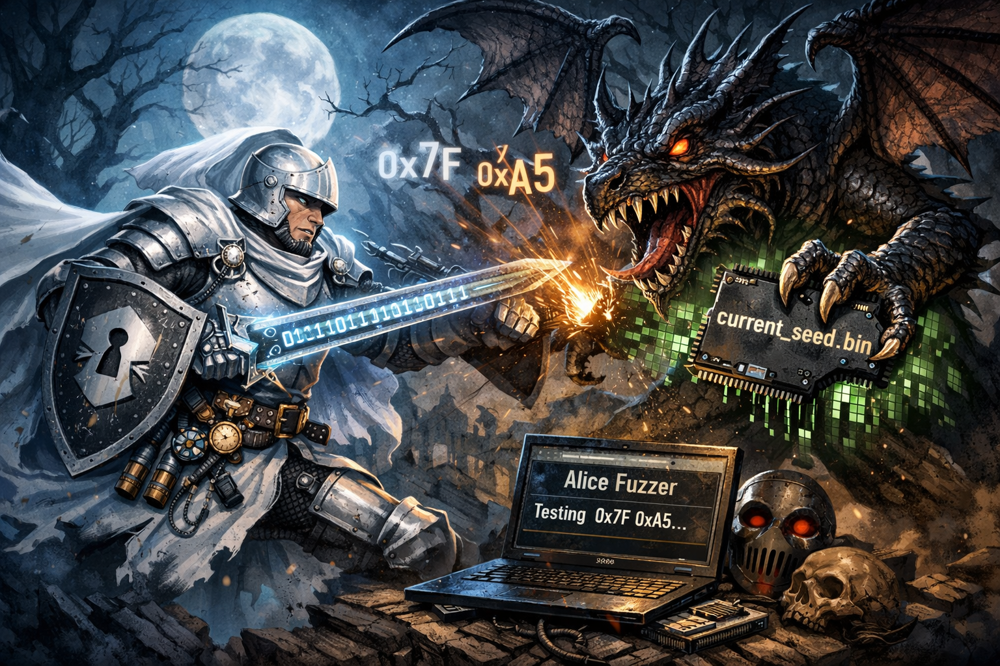

# 🐇 Alice in Kernel-Land: The White Knight Fuzzer 🗡️




> *“Beware the Jabberwock, my son!  
> The jaws that bite, the claws that catch!”* — Lewis Carroll

Welcome to **Alice’s Wonderland Fuzzer**, a weaponized poetic experiment into kernel space.  
A tale of entropy, heap structures, and ioctl mischief, this project pairs a RDRAND-based orchestrator with a dynamically injected chaos engine via `LD_PRELOAD`.

---

## Setup & Execution

You only need three files:
- `main.c` – the orchestrator
- `fuzz_logic.c` – the malicious payload (injected via `LD_PRELOAD`)
- `compile_fuzzer.sh` – a helper to build and run

### Copy, Paste, and Run:

```bash
cat << 'EOF' > compile_fuzzer.sh
#!/bin/bash
# 1. Compile the logic payload as a shared library
gcc -fPIC -shared fuzz_logic.c -o libfuzz.so

# 2. Compile the orchestrator binary
gcc main.c -o fuzzer_runner

# 3. Run with LD_PRELOAD and capture logs
LD_PRELOAD=./libfuzz.so ./fuzzer_runner > fuzz_output.log 2>&1
EOF

chmod +x compile_fuzzer.sh
./compile_fuzzer.sh
```

## Recommended Setup

    Component	Recommended
    Kernel Config	CONFIG_KASAN, DEBUG_LIST, DEBUG_SLAB
    Environment	QEMU VM or Nested VM with snapshot support
    User Privilege	Non-root (unless probing deeper subsystems)
    Monitoring Tools	dmesg -w, gdb, perf, trace-cmd, bcc

## Safety First

This project will crash kernels.

    Don’t run it on your host.
    Do run it in a disposable VM or debug kernel build.

## Philosophy

This fuzzer is a homage to the White Knight — clumsy, noble, and relentless in exploration.
It doesn’t care what it breaks — only what it reveals.

    “He left it dead, and with its head
    He went galumphing back.”

